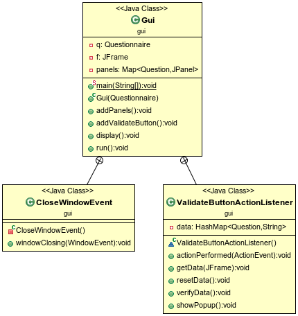
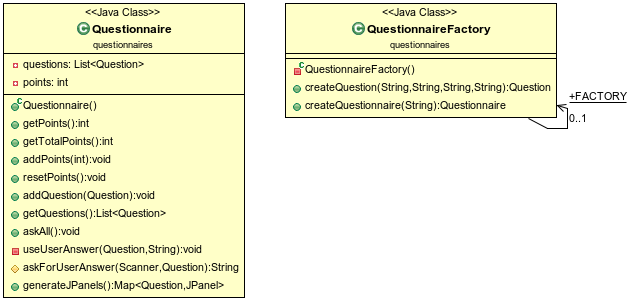
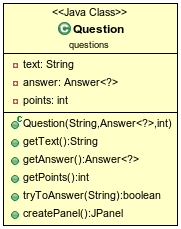

# Projet Questionnaires

Rendu de KROL Mikolaï et BART Sébastien Groupe 6.

## Introduction

Il s'agissait de construire des questionnaires utilisables en console 
ou avec une interface graphique (Swing).

## "How to..."

### Récupérer le projet

Pour récupérer le projet, placez vous dans le dossier cloné avec le dépôt git et tapez la commande `git pull`, saisissez
vos identifiants si besoin.  

### Générer la documentation

Pour générer la documentation du projet, placez vous à la racine de celui-ci (dossier *questionnaires*) et tapez `mvn javadoc:javadoc`  

La documentation se génère automatiquement, une fois le processus terminé, celle-ci se trouve dans le dossier */target/docs*.  
Pour ouvrir l'index, tapez, toujours à la racine `firefox target/docs/index.html`  

### Générer le projet

Pour générer le projet, tapez à la racine `mvn package`

Maven compile le projet et génère un fichier *.jar* exécutable, les fichier compilés se trouvent dans le dossier */target/classes*,
le jar exécutable se trouve dans */target*  

### Exécuter l'archive générée

Pour exécuter l'archive générée, tapez à la racine `java -jar target/questionnaires-1.0-SNAPSHOT.jar`.  

Il y a trois fichiers texte de questionnaire à disposition :

- questionnaire1.txt  
- questionnaire2.txt  
- questionnaire3.txt   

## Notes à propos du code

### Éléments pertinents (d'après nous du moins)
- Tout est propre

## Diagrammes UML

### Tout les packages  
  

### package answers  
  

### package gui   
  

### package questionnaires  
  

### package questions  
  

### package util  
  

###  main  
  

Fin.